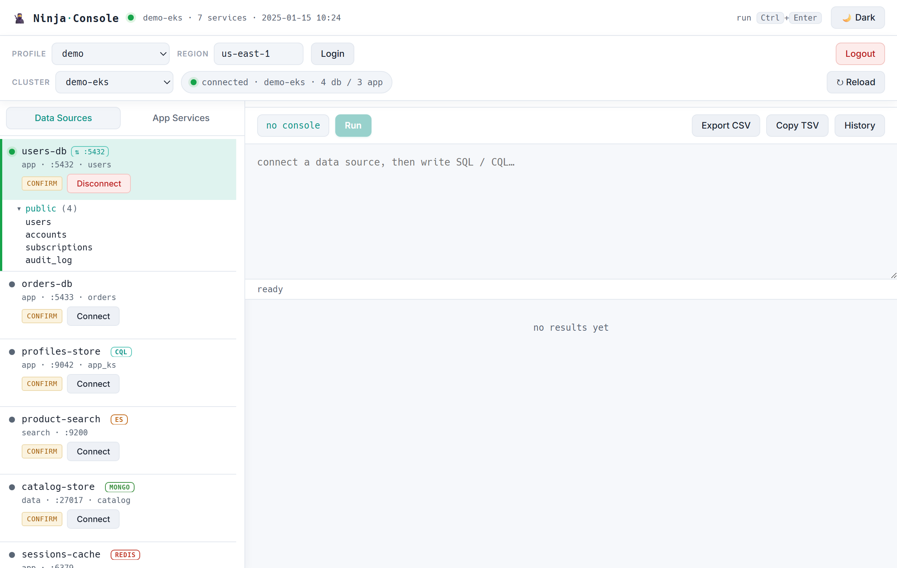
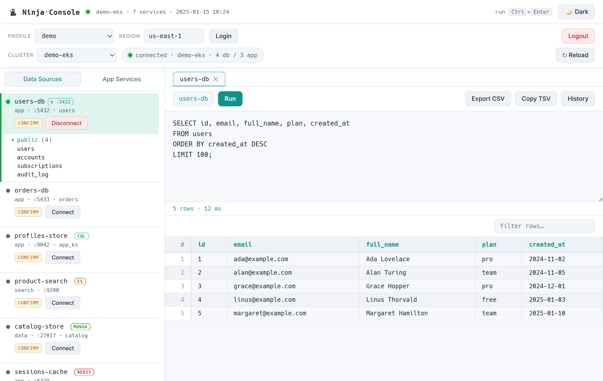

# 🥷 Ninja Console

A local, browser-based **multi-engine data console** for services running inside
your Kubernetes / EKS clusters. Log in to AWS, pick a cluster, discover its
datastores, port-forward them, and run queries — **Postgres, Cassandra/Scylla,
Elasticsearch, and MongoDB** — all from one page. No terminal gymnastics, no
build step, one command.

> One entrypoint • runs from source • single required dependency (`psycopg`) •
> everything binds `127.0.0.1` only • it never stores or displays your secrets.

## Screenshots

Multi-engine discovery — Postgres, Cassandra (CQL), Elasticsearch, MongoDB, Redis
and Kafka data sources in one cluster, each connectable and browsable:



Query console — SQL/CQL editor with a sortable, filterable results grid:



> _Screenshots use a sanitized demo cluster; real profile, cluster and service
> names are never shown._

## Features

- **Connection dashboard** — a persistent top bar shows the active AWS profile,
  region, cluster, and connection status. Switch profile/cluster at any time;
  switching tears down the old cluster's port-forwards first.
- **On-demand discovery** — finds databases in the active cluster (by well-known
  port / name), resolves credentials from the pods/secrets, and assigns local
  ports. Runs as a background job with streamed progress.
- **Per-cluster caching** — each cluster keeps its own saved discovery, so
  revisiting one loads instantly. **↻ Reload** re-discovers on demand.
- **Multi-engine querying** — a SQL/CQL editor + sortable results grid for
  tabular engines, and a JSON document viewer for document engines:
  | Engine | Query | Result |
  |---|---|---|
  | PostgreSQL | SQL | grid |
  | Cassandra / Scylla (CQL) | CQL | grid |
  | Elasticsearch / OpenSearch | ES SQL (`SELECT …`) or JSON DSL | grid / documents |
  | MongoDB | JSON find/aggregate spec | documents |
  | Redis | commands (`GET`, `SCAN`, `HGETALL`, …) | grid |
  | Kafka (read-only) | topic name → recent messages | documents |

  Kafka is a message browser (consume recent messages), not a query engine, and
  needs the broker to advertise a locally-reachable host — over a port-forward
  many clusters advertise internal addresses, which Kafka can't reach.
- **Write-safety modes** — per-source **read-only / confirm / unrestricted**,
  enforced server-side.
- **Light & dark themes** (Material-style dark), schema tree, query history,
  CSV/TSV export.

## Requirements

- Python 3.8+ (works on 3.14)
- `kubectl` and `aws` CLI on your PATH, plus your existing AWS/Okta login tool
  (e.g. `gimme-aws-creds`) if you use the built-in login flow
- Python packages: `psycopg` required; `cassandra-driver` / `pymongo` optional
  (see `requirements.txt`)

## Quick start

```bash
pip install "psycopg[binary]"
# optional engines:
pip install cassandra-driver pymongo redis kafka-python

python pg_console.py            # opens http://127.0.0.1:8765
```

Then in the browser: pick a **profile** → **Login** (approve the MFA push) → pick
a **cluster** → the databases appear under **Data Sources** → **Connect** and
query. `Ctrl+C` tears everything down.

It also boots fine with **no AWS creds and no artifact** — you land in a
not-connected dashboard and connect from the browser.

### Persistence — just run `python pg_console.py`

Discovery is cached **per cluster**: each cluster keeps one file,
`<artifacts_dir>/pg-services.<cluster>.json`, and Reload/Save overwrites it in
place (no duplicates). The last-opened cluster is remembered, so:

- **First run** → not-connected → Login → pick a cluster → **↻ Reload** →
  discovers and saves that cluster's file.
- **Every later run** → `python pg_console.py` (no flags) → **reopens that
  cluster's saved databases/apps automatically.** Switching clusters loads each
  one's file instantly.

## Configuration

Everything has sensible defaults; override via CLI flags or an optional config
file (`pg-console.json`, or `pg-console.yaml` if PyYAML is installed). Precedence:
**CLI flag > config file > default**. See `pg-console.config.example.json`.

```bash
python pg_console.py --region us-east-1 --okta-config ~/.okta_aws_login_config \
                     --artifacts-dir pg-artifacts --port 8765 --host 127.0.0.1
```

Common keys:

| Key / flag | Meaning |
|---|---|
| `region` / `--region` | Default AWS region for the dashboard |
| `okta_config` / `--okta-config` | Path to your okta login config |
| `artifacts_dir` / `--artifacts-dir` | Where per-cluster artifacts are **stored & loaded** (auto-created; default `pg-artifacts`) |
| `services` / `--services` | Force-load one specific artifact file (usually leave unset) |
| `gimme` / `aws` / `kubectl` | Executable names/paths for the CLIs |
| `port` / `host` / `no_forward` | Server bind + whether to auto port-forward |

Artifacts contain resolved credentials — keep `artifacts_dir` out of any
shared/synced/committed location (`pg-artifacts/` is git-ignored by default).

## How it works

```
pg_console.py    HTTP server, dashboard, routing, engine registry
pg_ui.html       single-page UI (loaded from disk)
pg_aws.py        okta/aws CLI orchestration (login, list clusters, kubeconfig)
pg_pipeline.py   login → clusters → kubeconfig dependency chain
pg_discovery.py  kubectl service discovery + credential resolution
pg_forward.py    kubectl port-forward lifecycle
pg_cql.py        Cassandra/Scylla engine   (lazy: cassandra-driver)
pg_es.py         Elasticsearch engine      (stdlib HTTP)
pg_mongo.py      MongoDB engine            (lazy: pymongo)
pg_redis.py      Redis engine              (lazy: redis)
pg_kafka.py      Kafka message browser     (lazy: kafka-python)
```

Non-Postgres engines are **optional and lazily imported** — if a driver isn't
installed, that engine is simply unavailable and the rest of the tool works.

## Security

- Binds to `127.0.0.1` only.
- Credentials are read from your cluster's secrets at connect time and used only
  to open the local connection — they are never sent to the browser or logged.
- Discovered artifacts (`pg-services*.json`) contain resolved credentials and are
  **git-ignored** — do not commit them.

## License

[MIT](LICENSE)
